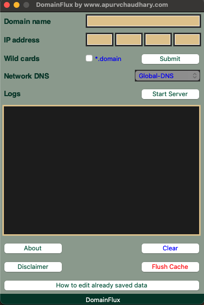
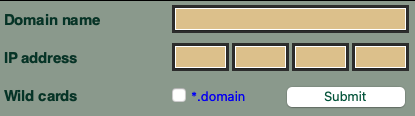
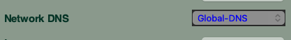
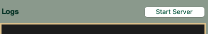
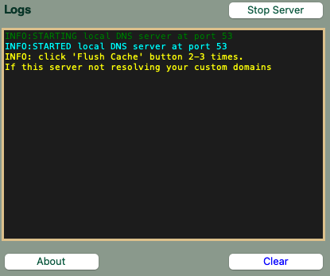
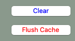
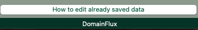
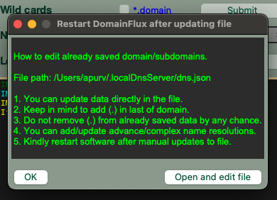
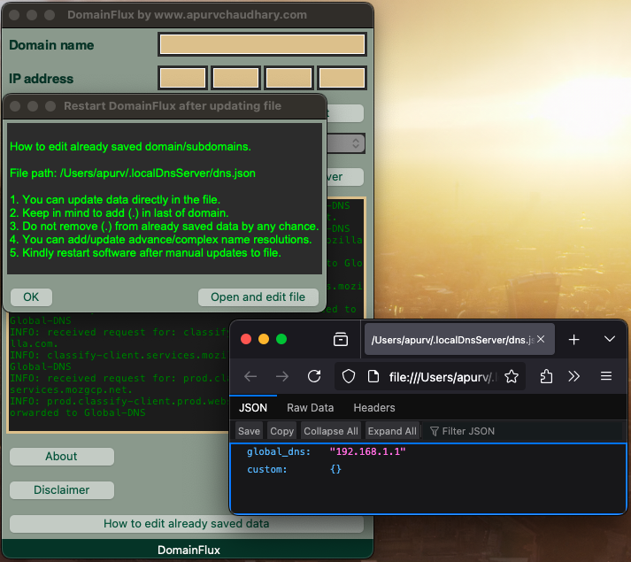

## DomainFlux is a local DNS server currently supporting to Mac (intel + Apple Silicon)/Window/Ubuntu OS.

### DomainFlux by Apurv Chaudhary

A local DNS server to resolve custom domains/subdomains.

You can download new versions from this repo.

<ul>
<li>For macOS: DomainFlux/MacOS/DomainFlux.zip</li>
<li>For windows: DomainFlux/WindowOS/DomainFlux.exe</li>
<li>For ubuntu: DomainFlux/UbuntuOS/DomainFlux</li>
<li>Note: It resolves your custom domain to IP</li>
</ul>

### GUI main window

This is the main screen.

### How to use it?

<ul>
<li>Add domain name to domain field. Note — Do not add with empty (.) root e.g., No: test. Yes: test Yes: test.com</li>
<li>Add IP address where this domain will resolute to.</li>
<li>Mark checkbox for wildcards i.e., subdomains, e.g., a.test or b.test etc. No need to add subdomain manually</li>
<li>Click on the submit button after filling up.</li>
</ul>

### What about domains which this server does not have?

<ul>
<li>Global-DNS will manage those domains</li>
<li>DomainFlux will forward dns query to Global-DNS if it can't resolve it.</li>
<li>Global-DNS will be showing options to select query resolver (Parent of DomainFlux)</li>
<li>You cannot start the DomainFlux server without selecting Global-DNS</li>
<li>This is one time process selecting Global-DNS. You can change it too.</li>
</ul>

### How to start DomainFlux server?

You can click on the Start Server button.

### Console to track logs?

<ul>
<li>This black screen is console to track logs of DomainFlux. (Vertically scrollable)</li>
<li>You can clear logs by clicking on the Clear button</li>
</ul>

### What if DomainFlux is not resolving my added domain?

<ul>
<li>Click on Flush Cache button to clear dns cache then it will work.</li>
<li>It needs sudo permission to flush DNS cache from the system.</li>
<li>It will ask your system password to run command.</li>
</ul>

### How to update/delete previously saved domains?

<ul>
<li>Click on the above button to see info for update/delete saved data.</li>
<li>It will open the window shown below.</li>
<li>It will also show you the path of file where data is stored. File path: </li>

<li>Click on Open and edit file button.</li>
<li>It will open file in an editor mode as shown below.</li>

<li>After manual intervention, you have to restart DomainFlux App.</li>
</ul>

### Happy Coding, kindly let me know if facing any issue.