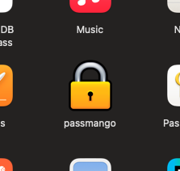
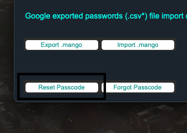
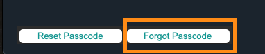
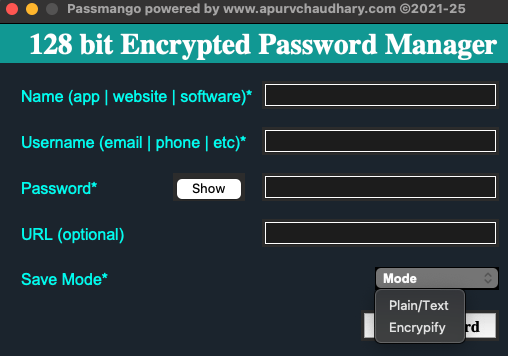
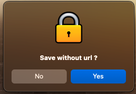
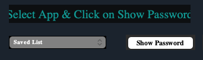
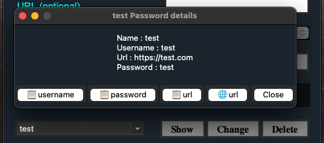
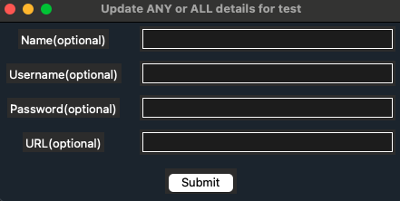
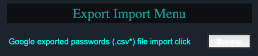
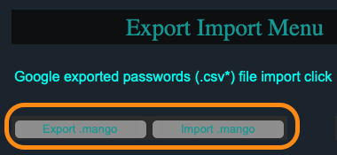

## 128-Bit encrypted Password Manager currently supporting to Mac (intel + Apple Silicon)/Window/Ubuntu OS.

<h2 style="color:grey;">Passmango by Apurv Chaudhary </h2>

128-bit encrypted password manager.

You can download new versions from this repo.

<ul>
<li>For macOS: PasswordManager/Mac OS supported/passmango1.0.7.zip</li>
<li>For windows: PasswordManager/Window OS supported/passmango1.0.7.exe</li>
<li>For ubuntu: PasswordManager/Linux OS Supported/passmango1.0.5</li>
<li style="color:#66FCF1;">Note: It manages the data in your system and does not connect to the internet in any aspect.</li>
</ul>

<h3 style="color:#66FCF1;"> How to download it? </h3>

You can download it from a mentioned path in repo. Mac will show warning as I am not a registered developer, but you 
can select download anyway.

<h3 style="color:#66FCF1;"> How to install it? </h3>

It comes in preloaded package you don't have to install it. You can directly run it after downloading.

<h3 style="color:#66FCF1;"> How to run it? </h3>

click on Passmango icon wherever you downloaded the app.

<h3 style="color:#66FCF1;"> Here is the main screen view of Passmango.</h3>

<h3 style="color:#66FCF1;"> What is the default passcode and how to change? </h3>

Default passcode is <b style="color:#66FCF1;">1234</b> you can change it from a change passcode option as shown 
below, first it will ask current passcode then will ask twice new one.

<h3 style="color:#66FCF1;"> What if I forgot my passcode? </h3>

<ul>
<li>'Forgot Passcode' option can handle that scenario.</li>
<li>But this button is for admin purpose.</li>
<li>In that case, <a href="https://www.apurvchaudhary.com/contact/">Contact Admin</a></li>
</ul>

<h3 style="color:#66FCF1;"> How to save password in it? </h3>
Fill details such as 
<li>Name</li>
<li>Username</li>
<li>Password (it will be in hidden mode, but you can toggle by switch to view/hide)</li>
<li>URL i.e optional</li>
<li>mode has two options described below
<ol>
    <li>Plain/Text: will save password in the same text form <b style="color:red;">(Not recommended!)</b></li>
    <li>Encrypify(Recommended): will save password in encrypted form</li>
    </ol>

<li>click on save after filling, it will ask for saving without url, if not provided:
<ol>
<li>if you want to add url, either add initially or after asking.</li>
<li>if you don't want to add url, then select 'No'</li>
</ol>

<h3 style="color:#66FCF1;"> Saved Passwords Menu </h3>

<ul> 
<li>click on dropdown to select password from the list or enter text to search from the list.</li>
<li>click on any button to show/change/delete and enter passcode</li>
</ul>

<ul>
<li>You can see the details. Also, buttons to copy: username, password, url.</li>
<li>You can directly open the url via button with internet symbol.</li>
</ul>

<h3 style="color:#66FCF1;"> How to update data for any entry?</h3>
<ul>
<li>click on the Change button, you will be asked to enter passcode.</li>
<li>You can update any/all the data such as Name, Username, Password, URL and click submit.</li>
</ul>
 

<h3 style="color:#66FCF1;"> What is Export Import Menu? </h3>

You can download passwords csv from Chrome browser and click on browse in Sync Browser password section. It will 
save password one by one.

<ul>
<li>It will ask mode of save once, i.e., Plain or Encrypify.</li>
<li>It will ask URL each time if not present in csv, you can select yes/no according to your preference.</li>
</ul>

<h3 style="color:#66FCF1;"> How can we share data from one system to another? </h3>
<ul>
<li style="color:red;">Note: Do not share exported .mango file to somebody who can compromise your data, as this data 
is in text form 
which is not encrypted.</li>
<li>click Export .mango which will generate a csv on desktop with all data in text form</li>
<li>click Import .mango to import data from .mango file.</li>
</ul>

<h3 style="color:#66FCF1;"> DISCLAIMER </h3>
For disclaimer click below right corner disclaimer button

<h3 style="color:#66FCF1;"> Like & Share </h3>
Kindly give a like to repo or send me a thankyou note on my official website, if you really find this open source 
utility useful and safe. Do share it with your friends.
<a href="https://www.apurvchaudhary.com/contact/">Send me a thankyou note.</a>

Here in readme I have attached SS of macOS, but it will be somewhat similar in all OS.
