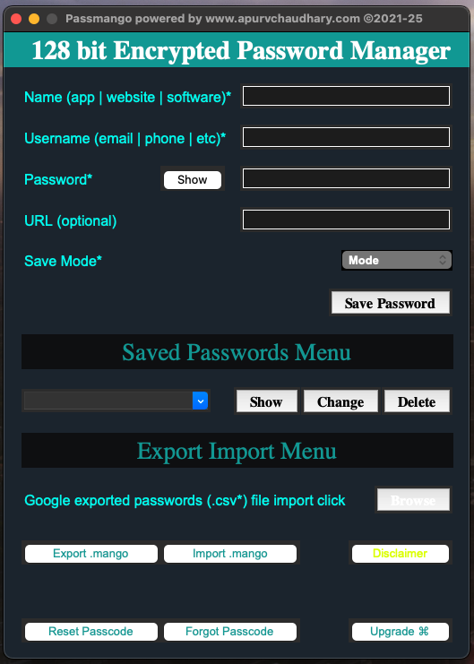

# GUIs in this repo.

## 1. DomainFlux (Local DNS server for custom domains)

<a href="https://github.com/apurvchaudhary/GUIs/tree/main/DomainFlux">About DomainFlux</a>

## 2. Passmango (128-bit encrypted personal password manager)

<a href="https://github.com/apurvchaudhary/GUIs/tree/main/PasswordManager">About Passmango</a>

